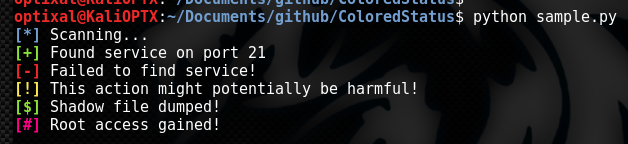

# ColoredStatus
Awesome and familiar colored status symbols to add flavor to your print outputs in Python 2.7.

## How It Looks


## Usage
Choose a code from the list below (eg. "good") and either:
* Call the ColoredStatus method for it (eg. coloredstatus.print_good("Found password hash"))
* Or call the ColoredStatus' variable for it and use is as part of the print function (eg. print coloredstatus.good + "Found password hash").

```python
import coloredstatus.py as cs

cs.print_good("Found password hash")
# or
print cs.good + "Found password hash"
```

Both will produce the same output of `[+] Found password hash`.

## Codes Available
Code | Symbol | Color
---- | ------ | -----
status | `[*]` | Light Blue
good | `[+]` | Light Green
error | `[-]` | Light Red
warning | `[!]` | Light Yellow
money | `[$]` | Light Green
special | `[#]` | Custom Pink
